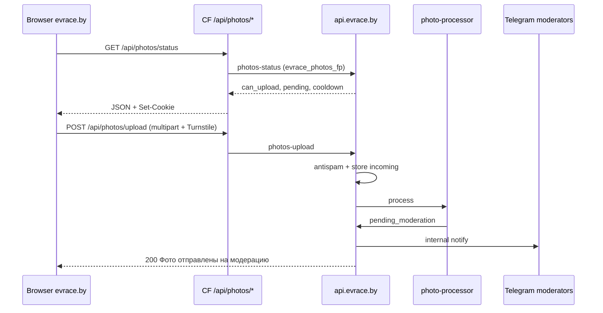

# EVrace Photos v1.4 — Phase 4B Implementation Plan (Upload UI, Type A)

**Version:** 1.1  
**Date:** 2026-06-12  
**Status:** **APPROVED — GO CODING** (PO sign-off 2026-06-12)  
**Prerequisites:** Phase 4A **Production Live** (gallery read on `evrace.by`)  
**Parent plan:** `EVrace_PHOTOS_V1.4_PHASE4_IMPLEMENTATION_PLAN.md` v1.1

**Baseline documents:**
- `EVrace_PHOTOS_V1.2_FINAL_IMPLEMENTATION_SPEC.md` (§15 upload copy, §11 duplicate copy)
- `EVrace_PHOTOS_V1.2_IMPLEMENTATION_PLAN.md` (§9.2, §9.4, §10)
- `PHASE4A_DEPLOYMENT_VERIFICATION.md` (4A complete)
- `PHASE2_DEPLOYMENT_VERIFICATION.md` / `PHASE3_DEPLOYMENT_VERIFICATION.md` (BY upload APIs verified)

---

## 1. Executive Summary

Phase 4B **exposes anonymous Type A photo upload** on location pages at `evrace.by`.  
Users select up to 3 images, pass Turnstile, and submit to the **existing** BY pipeline (`photos-upload` → processor → moderation).

| Layer | Phase 4B role |
|-------|----------------|
| **BY (`api.evrace.by`)** | **No pipeline changes** — reuse `POST photos-upload`, `GET photos-status` (Phase 2 verified) |
| **Cloud Supabase** | **No changes** |
| **CF Pages** | Cookie proxy routes, upload form UI, client JS, mobile UX, spec §15 copy |

**Product goal:** any visitor can contribute location photos anonymously; moderators receive the same Telegram flow as today.

**Explicitly not in 4B:** report UI (4C), Type B / review photos (4D), orphan flow (4E), Telegram upload attribution token (deferred per Q4-3).

---

## 2. Architecture Freeze (Locked — Do Not Redesign)

Treat as stable (same as Phase 4 master plan):

| Area | Locked decision |
|------|-----------------|
| Upload API | `POST photos-upload` multipart; cookie `evrace_photos_fp` |
| Antispam | 15 min cooldown per fingerprint; max 5 active pending (`uploaded`+`processing`) |
| Turnstile | Required on every submission |
| Processing | Sharp worker; dedupe at processor on final WEBP |
| Moderation | Telegram whitelist; internal notify; no UX change |
| Attribution | `author_type: anonymous` only in 4B (no `X-Photos-Tg-Token`) |

Phase 4B is **UI + CF proxy only**, not a backend redesign.

---

## 3. Current State (Post 4A)

### 3.1 Production-ready (reuse as-is)

| Component | Status |
|-----------|--------|
| `POST photos-upload` (BY) | ✅ Phase 2 verified |
| `GET photos-status` (BY) | ✅ Phase 2 verified |
| `photo-processor` + moderation notify | ✅ Phase 3 verified |
| Turnstile secret on BY (`TURNSTILE_SECRET_KEY`) | ✅ Production |
| CF env `PHOTOS_API_BASE`, `PHOTOS_BY_ANON_KEY` | ✅ Set in 4A release |
| Turnstile script on location page | ✅ Already in `[slug].js` |
| Site key (shared with CS/reviews) | ✅ `0x4AAAAAACtvG988gnpS7YBa` |

### 3.2 Not yet built (4B scope)

| Component | Current state |
|-----------|---------------|
| `GET /api/photos/status` CF proxy | ❌ Not implemented (gallery proxy only in 4A) |
| `POST /api/photos/upload` CF proxy | ❌ Not implemented |
| `photos-proxy.js` fingerprint cookie | ❌ Gallery proxy has no `evrace_photos_fp` handling |
| `renderPhotoUploadBlock()` in SSR | ❌ Function exists but **not wired** in `[slug].js` |
| `JS/photos-upload.js` | ❌ Missing |
| Upload block CSS | ❌ No `.loc-photo-upload-*` styles |
| E2E verification via `evrace.by` proxy | ❌ Missing |

### 3.3 Existing UI shells

```506:512:functions/_lib/location-render.js
export function renderPhotoUploadBlock() {
  return `<div class="blk loc-photo-upload-blk loc-grid-side" id="add-photo">
<div class="blk-hdr"><span class="blk-title">📷 ПОКАЖИ СТАНЦИЮ</span></div>
<div id="photo-upload-root" class="loc-photo-upload-body" aria-live="polite">
<p class="loc-form-consent">Загружая фотографии, вы соглашаетесь с <a href="/community-rules">Правилами сообщества</a>.</p>
</div>
</div>`;
}
```

Client hydrates `#photo-upload-root` (same pattern as `#review-form-root` / `#community-signals-form`).

---

## 4. Phase 4B Scope

### 4.1 In Scope

| # | Deliverable |
|---|-------------|
| B4-1 | **CF proxy** `GET /api/photos/status` → BY `photos-status` with `evrace_photos_fp` cookie |
| B4-2 | **CF proxy** `POST /api/photos/upload` → BY `photos-upload` (multipart forward + cookie) |
| B4-3 | **Wire** `renderPhotoUploadBlock()` into `[slug].js` (anchor `#add-photo`) |
| B4-4 | **`JS/photos-upload.js`** — file picker ≤3, previews optional, Turnstile, submit, error mapping |
| B4-5 | **Status handling** — load `photos-status` on init; disable form when `can_upload: false` |
| B4-6 | **Pending / cooldown UX** — human-readable RU states (see §8) |
| B4-7 | **Spec §15 copy** — anonymous hint + TG future paragraph (informational only) |
| B4-8 | **Mobile upload** — `accept="image/*"`, `capture` where appropriate, touch targets ≥44px |
| B4-9 | **CSS** — upload block aligned with location-page polish |
| B4-10 | Verification + `PHASE4B_DEPLOYMENT_VERIFICATION.md` |

### 4.2 Out of Scope (later sub-phases)

| Item | Target |
|------|--------|
| Report modal / `photos-report` UI | **4C** |
| Type B upload / `photos-upload-review` | **4D** |
| Review form `#add-photo` link wiring to upload | **4D** (optional teaser text only in 4B) |
| `X-Photos-Tg-Token` / `issue-photos-tg-token` | Post–4B optional |
| Orphan / soft-delete review | **4E** |
| BY API or moderation changes | Never in 4B |
| Gallery changes beyond success hint | 4A complete |

---

## 5. Backend (BY) — No Changes Expected

### 5.1 `POST photos-upload` (existing contract)

**Proxy target:** `https://api.evrace.by/functions/v1/photos-upload`

| Field | Notes |
|-------|-------|
| `location_id` | From `#loc-page-data` |
| `files` / `files[]` | 1–3 images, ≤10 MB each (JPEG/PNG/WebP) |
| `turnstile_token` | Required |

**Responses (UI must handle):**

| HTTP | `error` / body | User message (RU) |
|------|----------------|-------------------|
| 200 | `message: "Фото отправлены на модерацию"` | Success (spec locked) |
| 403 | `turnstile_failed` | «Проверка не прошла. Обновите страницу и попробуйте снова.» |
| 429 | `cooldown_active` + `cooldown_seconds` | «Подождите N мин перед следующей загрузкой.» |
| 429 | `pending_limit` | «Слишком много фото на модерации. Дождитесь решения.» |
| 400 | `too_many_files`, `file_too_large`, `invalid_file_type`, `no_files` | Specific short RU hints |
| 500 | `server_error`, `storage_failed` | «Не удалось отправить. Попробуйте позже.» |

**Note on duplicate (PO Q4B-2):** content-hash dedupe runs in **photo-processor**, not in `photos-upload`. API may return **200** while processor later rejects duplicate. 4B shows success on 200; duplicate rejection is invisible to user unless we add polling/API enhancement (see §15).

### 5.2 `GET photos-status` (existing contract)

**Proxy target:** `https://api.evrace.by/functions/v1/photos-status`

```json
{
  "fingerprint_ready": true,
  "pending_count": 0,
  "max_pending": 5,
  "cooldown_seconds": 0,
  "can_upload": true
}
```

UI rules:

| Condition | UX |
|-----------|-----|
| `can_upload: true` | Show full form + Turnstile + submit |
| `cooldown_seconds > 0` | Disable submit; show countdown (mm:ss or rounded minutes) |
| `pending_count >= max_pending` | Disable submit; explain moderation queue |
| Initial load fail | Non-blocking banner + retry button |

Optional: refresh status after successful upload (no gallery refresh required in 4B).

---

## 6. CF Pages — Proxy Layer

### 6.1 Extend `functions/_lib/photos-proxy.js`

Mirror `community-signals-proxy.js` pattern for **`evrace_photos_fp`**:

| Helper | Purpose |
|--------|---------|
| `resolvePhotosFingerprintCookie(cookieHeader)` | Read or mint UUID v4 |
| `photosForwardHeaders(env, fpValue)` | `apikey`, `Authorization`, `Cookie: evrace_photos_fp=…` |
| `photosProxyResponse(upstream, setCookie, cachePolicy)` | Merge upstream `Set-Cookie` + local fp cookie; **`Cache-Control: private, no-store`** for status/upload |

Cookie attributes (locked, match BY): `Path=/; HttpOnly; Secure; SameSite=Lax; Max-Age=31536000`.

### 6.2 New routes

| Route | File | Method | BY function |
|-------|------|--------|-------------|
| `/api/photos/status` | `functions/api/photos/status.js` | GET | `photos-status` |
| `/api/photos/upload` | `functions/api/photos/upload.js` | POST | `photos-upload` |

**Upload proxy requirements:**

- Forward raw `multipart/form-data` body (do not parse/rebuild unless required).
- Pass through `Content-Type` boundary from client request.
- Do **not** set JSON `Content-Type` on upstream request.
- Propagate status code and JSON body unchanged.

**Gallery proxy (4A):** unchanged; may share cookie helper so first visit to gallery mints fp early (optional optimization).

---

## 7. SSR & Page Integration

### 7.1 `[slug].js` changes

1. Import and render `renderPhotoUploadBlock()` in sidebar **after** `renderPhotosBlock()`, before `renderNearbyBlock()`.
2. Load script: `<script src="/JS/photos-upload.js?v=1"></script>` (after `photos-gallery.js`, before `location-page.js`).
3. No new env vars beyond 4A.

### 7.2 Layout & mobile (spec §13)

| Viewport | Placement |
|----------|-----------|
| Desktop sidebar | Order: **ФОТО ЛОКАЦИИ** → **📷 ПОКАЖИ СТАНЦИЮ** → Рядом |
| Mobile (`max-width: 899px`) | CSS `order` on `.loc-photo-upload-blk`: **after** `.loc-photos-blk` (order 6), bump `.loc-nearby-blk` to 7 |

**Regression QA:** community signals accordion + review form unchanged; test 3 real locations on mobile.

### 7.3 Cross-links

| Source | Target |
|--------|--------|
| Empty gallery CTA (4A) | Scroll to `#add-photo` (optional `photos-upload.js` or anchor link in empty state — PO Q4B-3) |
| Consent line | `/community-rules` (already in shell) |

---

## 8. Client — `JS/photos-upload.js`

### 8.1 Initialization

1. Read `location_id` from `#loc-page-data`.
2. `GET /api/photos/status` with `credentials: 'same-origin'`.
3. Render form or blocked state into `#photo-upload-root` (keep consent line).

### 8.2 Form structure

| Element | Behaviour |
|---------|-----------|
| Hint (§15) | Two paragraphs — anonymous + Telegram future (no functional TG button in 4B) |
| File input | `multiple`, `accept="image/*"`, max 3 files enforced client-side |
| Selected files list | Name + size; allow remove before submit |
| Turnstile | Reuse site key; `data-size="flexible"`; theme matches page |
| Submit | Disabled until ≥1 file + Turnstile token + `can_upload` |
| Progress | «Отправка…» on button during POST |

### 8.3 Submit

```http
POST /api/photos/upload
Content-Type: multipart/form-data
Cookie: evrace_photos_fp=…

location_id, turnstile_token, files (×1–3)
```

On success:

- Show **«Фото отправлены на модерацию»** (spec locked).
- Reset Turnstile + clear file input.
- Re-fetch status (user may hit pending limit).

On error: map `error` field to RU strings (§5.1 table); reset Turnstile on 403.

### 8.4 Pending / moderation states (UX copy)

| State | Copy (RU) |
|-------|-----------|
| Success | Фото отправлены на модерацию |
| Cooldown | Следующую загрузку можно через {N} мин |
| Pending cap | У вас {n} фото на модерации. Дождитесь решения модератора. |
| Turnstile fail | Проверка не прошла. Обновите страницу и попробуйте снова. |
| Network fail | Не удалось отправить. Проверьте связь и попробуйте снова. |

Do **not** expose fingerprint, internal IDs, or processor states (`uploaded` vs `processing`).

---

## 9. Product Copy (Locked — spec §15, §11)

| Context | RU copy |
|---------|---------|
| Block title | 📷 ПОКАЖИ СТАНЦИЮ (existing shell) |
| §15 paragraph 1 | Фото можно добавить анонимно. |
| §15 paragraph 2 | Через Telegram ваши публикации останутся за вами и смогут участвовать в будущих активностях и программах сообщества EVrace. |
| Consent | Загружая фотографии, вы соглашаетесь с Правилами сообщества. |
| Submit button | ОТПРАВИТЬ НА МОДЕРАЦИЮ |
| Success | Фото отправлены на модерацию |
| Duplicate (if API adds 409 later) | Похоже, такое фото этой локации уже есть в EVrace. Попробуйте выбрать другой ракурс или более актуальный снимок. |

---

## 10. Mobile-First Requirements

| Requirement | Implementation |
|-------------|----------------|
| Camera | `<input type="file" accept="image/*" capture="environment">` — test iOS Safari + Android Chrome |
| Touch targets | Submit + file picker row ≥44px height |
| Turnstile | `flexible` size; avoid layout jump (reserve min-height) |
| Slow network | Disable double-submit; show spinner on button |
| Orientation | Form usable in portrait; no horizontal scroll |

---

## 11. Security & Privacy

| Topic | Approach |
|-------|----------|
| Cookie scope | First-party `evrace.by` only via proxy |
| Secrets | No BY keys in client; only existing Turnstile site key |
| TG attribution | Not collected in 4B |
| File validation | Client size/count guard; server validates magic bytes |
| CSP | No new external scripts beyond existing Turnstile |

---

## 12. Verification Plan (Phase 4B)

Deliverable: `docs/PHASE4B_DEPLOYMENT_VERIFICATION.md`  
Automated: `infra/scripts/verify-photos-phase4b.mjs` (proxy-aware smoke on VPS + optional CF URL)

| # | Test | Expected |
|---|------|----------|
| B1 | `GET /api/photos/status` on `evrace.by` | 200 JSON; `Set-Cookie: evrace_photos_fp` on first visit |
| B2 | `POST /api/photos/upload` via proxy | 200; `accepted ≥ 1`; cookie persisted |
| B3 | Turnstile fail | 403 `turnstile_failed` |
| B4 | Cooldown | 429 after second submission within 15 min |
| B5 | Pending limit | 429 when active pending + batch > 5 |
| B6 | UI blocked states | Form disabled with correct RU copy |
| B7 | Mobile smoke | File picker opens; submit works on one mobile browser |
| B8 | Moderation path | Photo reaches Telegram queue (manual mod approve → 4A gallery within cache rules) |
| B9 | No regression | 4A gallery + CS + reviews still work |
| B10 | Status sync after upload (same fingerprint) | `pending_count` ↑; `can_upload` matches backend |

Target: **10/10 PASS** automated where possible + manual UX on 2 locations.

---

## 13. Deployment Overview

### 13.1 BY VPS

**No deploy required** if Phase 2/3 functions still live (confirm with `curl photos-status`).

Optional: re-run `verify-photos-phase2.mjs` if VPS was rebuilt since Phase 3.

### 13.2 CF Pages

1. Deploy proxy routes + `photos-upload.js` + CSS + `[slug].js` wiring.
2. Env vars from 4A already sufficient (`PHOTOS_API_BASE`, `PHOTOS_BY_ANON_KEY`).
3. Production smoke on `https://evrace.by/{op}/{slug}#add-photo`.

### 13.3 Rollback

| Action | Effect |
|--------|--------|
| Remove upload script + block from `[slug].js` | Upload UI hidden; gallery unaffected |
| Disable proxy routes | Upload/status 404; no BY impact |

---

## 14. Risks

| Risk | Mitigation |
|------|------------|
| Multipart proxy breaks boundary | Stream body through; integration test in B2 |
| Duplicate UX gap (processor-only dedupe) | Document Q4B-2; optional follow-up |
| Mobile Turnstile layout shift | Reserve height; test real devices |
| Cooldown UX confusion | Show explicit minutes remaining |
| User uploads before moderator clears queue | `pending_limit` + copy |
| 4A HTML cache after approve | Unchanged §8.1 — document in 4B smoke notes |

---

## 15. PO Decisions (resolved 2026-06-12)

| ID | Decision | Status |
|----|----------|--------|
| Q4B-1 | Empty gallery anchor «Добавить фото ↓» → `#add-photo` | ✅ Approved |
| Q4B-2 | Processor-side dedupe; no API redesign in 4B | ✅ Approved |
| Q4B-3 | Full §15 text; TG paragraph informational only | ✅ Approved |
| Q4B-4 | Client-side previews | ⏸ Deferred → 4B.1 |
| Q4B-5 | Manual «Обновить статус» only; no auto-poll | ✅ Approved |

---

## 16. Pre-Code Checklist

- [x] PO approves Phase 4B plan v1.1
- [x] Q4B-1 … Q4B-5 resolved
- [x] **GO Phase 4B coding**

---

## 17. Implementation Order (within 4B)

| Step | Task | Est. |
|------|------|------|
| 1 | Extend `photos-proxy.js` (fp cookie + no-store) | S |
| 2 | Add `status.js` + `upload.js` proxy routes | S |
| 3 | Proxy smoke on local/wrangler or staging | S |
| 4 | `photos-upload.js` + error mapping | M |
| 5 | Wire SSR block + CSS + mobile order | M |
| 6 | Optional empty-state link to `#add-photo` | S |
| 7 | `verify-photos-phase4b.mjs` + deployment doc | M |
| 8 | CF production deploy + manual smoke | S |

**S** = small, **M** = medium. Single release **4B only** (not bundled with 4C).

---

## 18. Acceptance Criteria (traceability)

| Criterion | 4B covers |
|-----------|-----------|
| Anonymous upload UI on location page | ✅ |
| Turnstile on upload | ✅ |
| ≤3 files, ≤10 MB | ✅ |
| Spec §15 copy | ✅ |
| Antispam cooldown / pending limit surfaced | ✅ |
| Cookie `evrace_photos_fp` on `evrace.by` | ✅ |
| Moderation unchanged | ✅ (no backend edits) |

Already complete: processor, Telegram moderation, gallery read (4A).

---

## 19. Document History

| Version | Date | Notes |
|---------|------|-------|
| 1.0 | 2026-06-12 | Initial Phase 4B plan — pending approval |
| 1.1 | 2026-06-12 | PO decisions locked; B10 added; **GO coding** |

---

## Appendix A — Data Flow (4B)



---

## Appendix B — Files Touched (expected diff)

| File | Change |
|------|--------|
| `functions/_lib/photos-proxy.js` | Fingerprint cookie helpers |
| `functions/api/photos/status.js` | **New** |
| `functions/api/photos/upload.js` | **New** |
| `functions/[operator_slug]/[slug].js` | Wire upload block + script |
| `functions/_lib/location-render.js` | Optional empty-state link; upload shell tweak |
| `JS/photos-upload.js` | **New** |
| `CSS/location-page.css` | Upload block + mobile order |
| `infra/scripts/verify-photos-phase4b.mjs` | **New** |
| `docs/PHASE4B_DEPLOYMENT_VERIFICATION.md` | **New** |

**Not touched:** BY edge functions, moderation, gallery JS (except optional anchor link).
