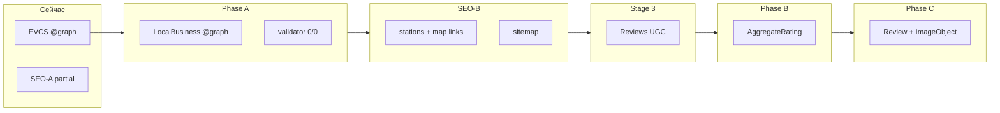

# Structured Data — план миграции EVCS → LocalBusiness

**Дата:** 2026-06-05  
**Статус:** Phase A **IMPLEMENTED** (code), production **NOT VERIFIED**  
**Решения утверждены:** 2026-06-05

**Связанные документы:** `SEO-A-DECISIONS.md`, `SEO-A-P0-VERIFICATION-REPORT.md`, `LOCATION-PAGE-SEO-FOUNDATION.md`

---

## 0. Решение: STOP EVCS

**Дальнейшие исправления `ElectricVehicleChargingStation` — остановлены.**

Текущий SEO-A P0 (validator 0/0 на EVCS) **не является целевым состоянием**. Production-проверка EVCS **не блокирует** закрытие инфраструктурных задач (terminology, power, H1), но **не закрывает Schema** до миграции.

| Факт | Источник |
|------|----------|
| `https://schema.org/ElectricVehicleChargingStation` → **404** | Проверка 2026-06-05 |
| В Schema.org нет типа EVCS | Официальный сайт schema.org |
| FIWARE / Smart Data Models используют **`EVChargingStation`** (NGSI-LD) | [FIWARE EVChargingStation spec](https://fiware-datamodels.readthedocs.io/en/stable/Transportation/EVChargingStation/doc/spec/index.html) |
| Наш код использует **`ElectricVehicleChargingStation`** — гибрид FIWARE-полей (`operator`) + несуществующего `@type` | `functions/_lib/location-seo.js` |
| validator.schema.org помечает неизвестный тип | Ожидаемое поведение |
| Google Rich Results **не** имеет типа EVCS в Gallery | Подтверждено в `LOCATION-PAGE-SEO-FOUNDATION.md` §1 |

**Вывод:** JSON-LD с EVCS — семантически полезен для людей, но **не валиден как Schema.org** и **не даёт rich results**. Нужна миграция на типы из vocabulary schema.org.

---

## 1. Целевая модель (@graph)

### 1.1 Принципы

1. **Один `@graph`** на location page (как сейчас).
2. **Главная сущность места** — `LocalBusiness` (не EVCS, не Place-only).
3. **Связь страница ↔ место** — `LocalBusiness.mainEntityOfPage → WebPage.@id` (inverse; без `WebPage.mainEntity`).
4. **Оператор** — отдельный `Organization` в graph, ссылка через `provider` (или `brand`).
5. **Инфраструктура зарядки** — `amenityFeature` + `additionalProperty` (сохраняем контракт power/connectors/count).
6. **Отзывы** — только Phase B/C; не смешивать с Phase A.

### 1.2 Целевой graph (Phase A — без отзывов)

```json
{
  "@context": "https://schema.org",
  "@graph": [
    {
      "@type": "WebPage",
      "@id": "https://evrace.by/{operator}/{slug}",
      "url": "…",
      "name": "…",
      "description": "…",
      "inLanguage": "ru-BY",
      "isPartOf": { "@type": "WebSite", "name": "EV RACE", "url": "https://evrace.by/" },
      "breadcrumb": { "@id": "…#breadcrumb" }
    },
    {
      "@type": "BreadcrumbList",
      "@id": "…#breadcrumb",
      "itemListElement": [ … ]
    },
    {
      "@type": "Organization",
      "@id": "https://evrace.by/operators/{operator_slug}#org",
      "name": "Zaryadka",
      "url": "https://evrace.by/operators/{operator_slug}"
    },
    {
      "@type": "LocalBusiness",
      "@id": "https://evrace.by/{operator}/{slug}#business",
      "mainEntityOfPage": { "@id": "https://evrace.by/{operator}/{slug}" },
      "name": "Зарядная станция Zaryadka — Минск, …",
      "description": "…",
      "url": "https://evrace.by/{operator}/{slug}",
      "address": { "@type": "PostalAddress", … },
      "geo": { "@type": "GeoCoordinates", … },
      "provider": { "@id": "https://evrace.by/operators/{operator_slug}#org" },
      "additionalType": "https://schema.org/AutomotiveBusiness",
      "amenityFeature": [ … ],
      "additionalProperty": [ … ]
    }
  ]
}
```

### 1.3 Почему LocalBusiness, а не Place

| Критерий | Place | LocalBusiness |
|----------|-------|---------------|
| В Schema.org | ✅ | ✅ |
| validator.schema.org | ✅ | ✅ |
| `address`, `geo`, `amenityFeature`, `additionalProperty` | ✅ | ✅ |
| Google Local Business guidelines | частично | ✅ [документация](https://developers.google.com/search/docs/appearance/structured-data/local-business) |
| `aggregateRating`, `review` (Phase B/C) | ограниченно | ✅ recommended |
| `provider` / оператор | через `owner` / generic | ✅ `provider`, `brand` |

**Рекомендация:** `LocalBusiness` + опционально `additionalType: AutomotiveBusiness` для уточнения домена без выдуманного EV-типа.

**Не использовать:** `GasStation` — семантически неверно для EV.

---

## 2. Маппинг свойств (текущее → целевое)

### 2.1 Узел EVCS → LocalBusiness

| Сейчас (EVCS) | Phase A (LocalBusiness) | Примечание |
|---------------|-------------------------|------------|
| `@id: …#evcs` | `@id: …#business` | Breaking для закладок в graph; только `@id` |
| `@type: ElectricVehicleChargingStation` | `@type: LocalBusiness` | Обязательная замена |
| — | `additionalType: AutomotiveBusiness` | Опционально; уточнение без non-schema типа |
| `mainEntityOfPage` | `mainEntityOfPage` | **Сохранить** |
| `name` | `name` | Нейтральный шаблон без изменений |
| `description` | `description` | = meta description |
| `url` | `url` | Canonical location URL |
| `address` | `address` | PostalAddress BY |
| `geo` | `geo` | GeoCoordinates |
| `operator: Organization` | `provider: { @id: …#org }` | `operator` **не** свойство LocalBusiness в schema.org |
| `amenityFeature[]` | `amenityFeature[]` | 1:1 перенос |
| `additionalProperty[]` | `additionalProperty[]` | 1:1 перенос |

### 2.2 amenityFeature (без изменений логики)

| Feature | Условие |
|---------|---------|
| `DC charging` | `maxDcKw > 0` |
| `AC charging` | `maxAcKw > 0` |
| `{connector label}` | каждый разъём из stats |

Тип: `LocationFeatureSpecification` + `name` + `value: true` — валидно для `Place`/`LocalBusiness`.

### 2.3 additionalProperty (power contract — сохранить)

| name | value | Слой |
|------|-------|------|
| `connector_types` | CSV labels | SEO / search intent |
| `max_power_kw` | max post | SEO primary |
| `total_installed_kw` | sum | Infra secondary |
| `station_count` | count | Infra |
| `simultaneous_charging_count` | totalSim | Infra |
| `max_dc_kw` | max DC post | Detail |
| `max_ac_kw` | max AC post | Detail |

**Namespace:** оставить `PropertyValue` с `name`/`value` — schema.org допускает для характеристик без dedicated property.

### 2.4 Organization (оператор)

| Поле | Источник |
|------|----------|
| `@id` | `https://evrace.by/operators/{operator_slug}#org` (стабильный) |
| `name` | `opDisplayName(operator_slug)` |
| `url` | страница оператора (если есть) или canonical brand page |

**Связь:** `LocalBusiness.provider → Organization.@id`.

Альтернатива: inline `Organization` без `@id` (проще, слабее связность между локациями одного оператора). **Рекомендация:** отдельный узел в `@graph`.

### 2.5 WebPage + BreadcrumbList

**Без структурных изменений** относительно текущего SEO-A (кроме отсутствия EVCS-узла):

- `WebPage.breadcrumb → #breadcrumb`
- **Нет** `WebPage.mainEntity`
- BreadcrumbList: Главная → Зарядные станции → локация

---

## 3. Phase B — AggregateRating (после Stage 3)

### 3.1 Условия включения

| Условие | Значение |
|---------|----------|
| Stage 3 live | отзывы на prod |
| Минимум отзывов | ≥ 3 (как в `LOCATION-PAGE-SEO-AUDIT.md`) |
| Данные | `cached_avg_rating`, `cached_review_count` |

### 3.2 Размещение

На узле `LocalBusiness`:

```json
"aggregateRating": {
  "@type": "AggregateRating",
  "ratingValue": 4.2,
  "reviewCount": 7,
  "bestRating": 5,
  "worstRating": 1
}
```

### 3.3 Google / validator

- `AggregateRating` — [Review snippet guidelines](https://developers.google.com/search/docs/appearance/structured-data/review-snippet).
- Rich result **не гарантирован**; validator должен принять тип.
- **Self-serving reviews:** Google ограничивает звёзды для LocalBusiness без third-party reviews — **риск** для UGC на собственном домене. Требует отдельного legal/product review перед Phase B.

### 3.4 Зависимости

- Phase B **только после** Stage 3 backend + модерация.
- Phase B **не блокирует** SEO-B (sitemap/linking).

---

## 4. Phase C — Review и фотографии

### 4.1 Review

На `LocalBusiness`:

```json
"review": [
  {
    "@type": "Review",
    "@id": "https://evrace.by/{operator}/{slug}#review-{id}",
    "author": { "@type": "Person", "name": "…" },
    "datePublished": "2026-05-01",
    "reviewBody": "…",
    "reviewRating": {
      "@type": "Rating",
      "ratingValue": 5,
      "bestRating": 5
    },
    "itemReviewed": { "@id": "…#business" }
  }
]
```

**Объём:** только видимые на SSR отзывы (первая страница / top N), не вся БД — иначе раздувание HTML.

### 4.2 Фотографии

| Подход | Schema.org | Рекомендация |
|--------|------------|--------------|
| `Review.associatedMedia` → `ImageObject` | ✅ | Phase C — фото из отзыва |
| `LocalBusiness.image` | ✅ | hero / og-map при необходимости |
| `Photo` type | ❌ нет в core | не использовать |

```json
"associatedMedia": {
  "@type": "ImageObject",
  "url": "https://…",
  "caption": "…"
}
```

### 4.3 Зависимости

- Phase C после Phase B (или одновременно с B при первом релизе Stage 3).
- Требует стабильных URL фото (R2/CDN).

---

## 5. Migration plan — фазы



| Phase | Scope | Код | Validator | Rich Results |
|-------|-------|-----|-----------|--------------|
| **A** | EVCS → LocalBusiness + Organization + перенос infra props | `location-seo.js`, verifiers, docs | **0/0** — цель | LocalBusiness — возможны knowledge panel элементы; **не цель** |
| **SEO-B** | linking + sitemap | отдельный трек | — | индексация |
| **Stage 3** | отзывы UGC | community layer | — | подготовка к B/C |
| **B** | AggregateRating | `location-seo.js` + data gate | 0/0 | review stars — **maybe** |
| **C** | Review + photos | SSR reviews block | 0/0 | расширение snippet |

### Phase A — задачи (оценка ~1–2 d)

1. Заменить `buildLocationJsonLdGraph`: EVCS → LocalBusiness + Organization node.
2. `@id` `#evcs` → `#business`; обновить verifiers.
3. `operator` → `provider` + linked Organization.
4. Прогнать validator на AC-MST, MIX-ZAR, DC-ORG.
5. Обновить `SEO-A-DECISIONS`, verification scripts, **переопределить Schema DoD** под LocalBusiness.
6. **Не трогать:** meta, og, H1, UI KPI, power contract.

### Phase B — задачи (~0.5 d + product review)

1. Gate: `review_count >= 3`.
2. Добавить `aggregateRating` на LocalBusiness.
3. Google Search Console — мониторинг review rich results / manual actions.

### Phase C — задачи (~1 d)

1. Маппинг `community.reviews[]` → `Review` entities.
2. `ImageObject` для фото отзывов.
3. Лимит N отзывов в JSON-LD; пагинация не в schema.

---

## 6. Влияние на текущие страницы

### 6.1 Что **не меняется** (Phase A)

| Слой | Файлы | Impact |
|------|-------|--------|
| SSR layout / hero | `location-render.js` | None |
| Meta / OG / Title | `location-seo.js` (buildLocationSeo) | None |
| H1 | `buildH1Text` | None |
| Power UI / description | SEO-A P0 power | None |
| AC terminology | station-badges | None |
| Breadcrumb UI (visual) | site-chrome | None |
| Leaflet / map | location-map.js | None |

**Пользовательский HTML** — идентичен; меняется **только** содержимое `<script type="application/ld+json">`.

### 6.2 Что **меняется** (Phase A)

| Область | Impact |
|---------|--------|
| JSON-LD `@type` | EVCS → LocalBusiness |
| JSON-LD `@id` fragment | `#evcs` → `#business` |
| Operator linkage | `operator` → `provider` + Organization `@id` |
| validator.schema.org | FAIL (unknown type) → **expected PASS** |
| `scripts/verify-seo-a-p0-production.mjs` | искать LocalBusiness, не EVCS |
| `scripts/verify-location-seo-local.mjs` | то же |
| Docs SEO-A | Schema DoD переписать под LocalBusiness |

### 6.3 SEO-A статус (пересмотр)

| Блок SEO-A | Статус после STOP EVCS |
|------------|------------------------|
| AC terminology | IMPLEMENTED — prod ⏳ |
| Power alignment | IMPLEMENTED — prod ⏳ |
| H1 / description / connectors | IMPLEMENTED — prod ⏳ |
| **Schema (EVCS)** | **CANCELLED** → заменён Phase A migration |
| **Schema (LocalBusiness)** | **NEW gate** для закрытия SEO-A Schema части |

**Предложение:** разделить SEO-A на:

- **SEO-A-core** (terminology, power, H1, meta) — текущий P0 без schema type.
- **SEO-A-schema** — Phase A migration → validator 0/0.

Закрытие **полного SEO-A** = core prod PASS + Phase A prod PASS.

### 6.4 SEO-B и Stage 3

| Трек | Изменение порядка |
|------|-------------------|
| **SEO-B** | Можно начинать **параллельно Phase A** (linking/sitemap не зависят от JSON-LD типа) **или** сразу после Phase A — на усмотрение PM |
| **Stage 3** | Без изменений: **после SEO-B** |
| **Phase B/C** | **После Stage 3** |

---

## 7. Риски и открытые вопросы

| # | Риск | Митигация |
|---|------|-----------|
| 1 | Google не покажет stars для first-party reviews | Product/legal review до Phase B; не обещать rich results |
| 2 | `AutomotiveBusiness` as additionalType — достаточно ли специфично | A/B в validator; fallback — только LocalBusiness |
| 3 | Organization `@id` без реальной страницы `/operators/{slug}` | Создать stub pages или inline Organization в Phase A |
| 4 | Дублирование `description` WebPage + LocalBusiness | Допустимо; оба = meta contract |
| 5 | Старые документы с EVCS examples | Deprecation banner в audit docs |
| 6 | External tools crawled EVCS | После deploy — мониторинг GSC structured data reports |

### Открытые вопросы — **РЕШЕНО**

1. **Organization `@id`:** `https://evrace.by/operator/{slug}` — постоянный, без `#org`. Страница может появиться позже; `@id` не менять.
2. **additionalType:** **не использовать** (только `LocalBusiness`).
3. **SEO-A:** Core (terminology, power, H1) и Schema Migration — **раздельные gates**.
4. **SEO-B:** **параллельно** с Phase A.

---

## 8. Acceptance criteria

### Phase A — DONE когда

```text
validator.schema.org — 0 errors, 0 warnings
  AC-MST, MIX-ZAR, DC-ORG

JSON-LD @graph contains:
  WebPage + BreadcrumbList + LocalBusiness + Organization

LocalBusiness:
  mainEntityOfPage ✅
  address + geo ✅
  provider → Organization ✅
  amenityFeature + additionalProperty (power contract) ✅

WebPage.mainEntity — absent ✅

Meta / UI / power — regression PASS
```

### Phase B — DONE когда

```text
Stage 3 live + review_count >= 3 on smoke URLs
aggregateRating on LocalBusiness
validator 0/0
GSC — no critical structured data errors
```

### Phase C — DONE когда

```text
review[] on LocalBusiness for visible SSR reviews
ImageObject where photos exist
validator 0/0 on review-enriched locations
```

---

## 9. Рекомендуемая последовательность

```text
1. Утвердить этот план (+ ответы §7)
2. Phase A — LocalBusiness migration (1 PR)
3. SEO-A-core production PASS (terminology + power)
4. SEO-A-schema production PASS (validator LocalBusiness)
5. SEO-B (stations, map, sitemap)
6. Stage 3 (reviews)
7. Phase B (AggregateRating)
8. Phase C (Review + photos)
```

**Не делать:** дальнейшие патчи EVCS, production sign-off EVCS validator, AggregateRating до Stage 3.

---

## 10. Файлы для изменения (Phase A — справочно, не сейчас)

| Файл | Изменение |
|------|-----------|
| `functions/_lib/location-seo.js` | `buildLocationJsonLdGraph` rewrite |
| `functions/[operator_slug]/[slug].js` | только если bump cache/version |
| `scripts/verify-*.mjs` | LocalBusiness assertions |
| `docs/SEO-A-DECISIONS.md` | Schema section → LocalBusiness |
| `docs/SEO-A-P0-VERIFICATION-REPORT.md` | новые checks |
| `docs/LOCATION-PAGE-SEO-FOUNDATION.md` | §1 EVCS → deprecated |

**Supabase `get-location`:** JSON-LD генерируется в Pages Function, не в edge function — sync не требуется для Phase A.

---

## Appendix A — текущий graph (inventory)

Источник: `buildLocationJsonLdGraph` в `location-seo.js`.

**Узлы:** WebPage, ElectricVehicleChargingStation, BreadcrumbList (3 + без Organization).

**EVCS properties в prod-коде:** name, description, url, address, geo, operator (inline Organization), mainEntityOfPage, amenityFeature, additionalProperty (7 keys).

**Отсутствует:** AggregateRating, Review, ImageObject, provider, отдельный Organization `@id`.

---

## Appendix B — ссылки

- [schema.org/LocalBusiness](https://schema.org/LocalBusiness)
- [schema.org/LocationFeatureSpecification](https://schema.org/LocationFeatureSpecification)
- [Google Local Business structured data](https://developers.google.com/search/docs/appearance/structured-data/local-business)
- [FIWARE EVChargingStation](https://fiware-datamodels.readthedocs.io/en/stable/Transportation/EVChargingStation/doc/spec/index.html)
- [schema.org/ElectricVehicleChargingStation](https://schema.org/ElectricVehicleChargingStation) — **404**
